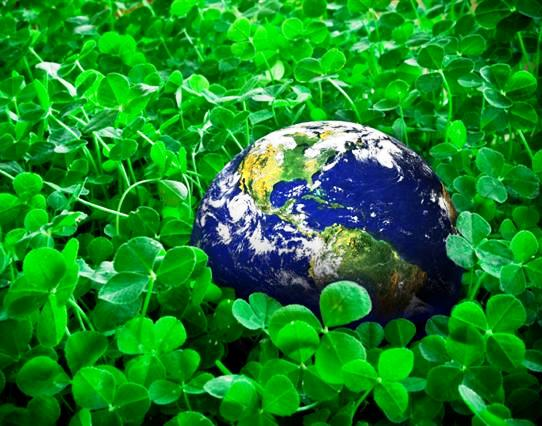

---
title:
author: "cjlortie"
date: "August 2016"
output:
  html_document:
    theme: yeti
    toc: yes
    toc_depth: 3
    toc_float: yes
  pdf_document:
    toc: yes
---
##ESA2106 observations & ideas

###Hypothesis
Conferences are an experiment in collaboration, communication, and learning.



[ecoblender](http://ecoblender.org)

###Methods

Fully non-random and likely non-representative sampling of talks and posters.
Inspired by the passion and the risk that some take at conferences.
Curious about patterns that emerge for ecologists outside of their natural setting.
Perhaps conferences need to be a natural setting for us though if we want to make a big difference.

```{r, setup, include=FALSE}
knitr::opts_chunk$set(cache=TRUE)
#library loads ####
library(dplyr)
library(lme4)
library(lattice)
library(latticeExtra)
library(lsmeans)
library(indicspecies)
library(vegan)
library(boot)
library(ggplot2)
select <- dplyr::select

##load functions ####
error.bar <- function(x, y, upper, lower=upper, length=0,...){
  if(length(x) != length(y) | length(y) !=length(lower) | length(lower) != length(upper))
    stop("vectors must be same length")
  arrows(x,y+upper, x, y-lower, angle=90, code=3, length=0, ...)
}
se <- function(x) sd(x)/sqrt(length(x)) ## SE
```

### cjlortie quick observations
```{r, observations in situ}
#data ####
obs <-read.csv("data/cjl.ESA2016.obs.csv")
str(obs)
obs
obs <- obs %>% mutate(p = (count/n))
#viz ####
v <-ggplot(data=obs, aes(x=attribute, y=p)) +
  geom_bar(stat="identity")
v +theme(axis.text=element_text(size=12),
        axis.title=element_text(size=14))
v + coord_flip()
```
